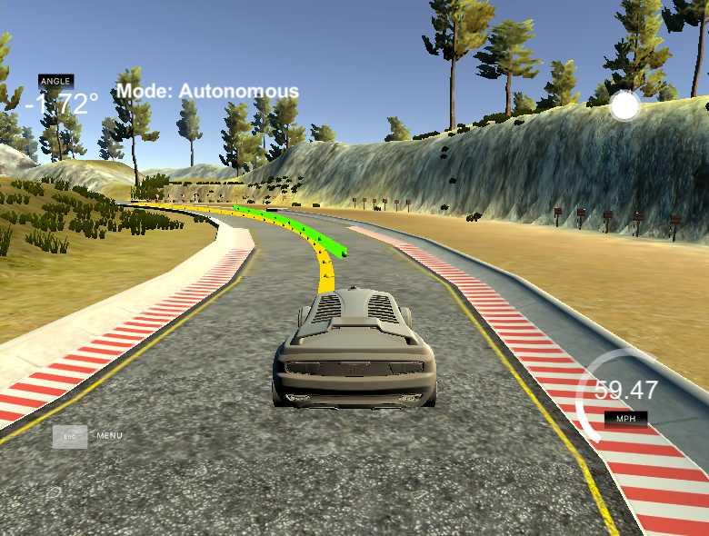
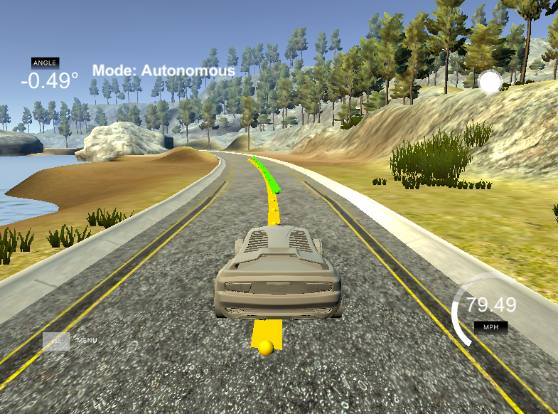

# CarND-Controls-MPC
Self-Driving Car Engineer Nanodegree Program

## Summary
This implementation of a Model Predictive Controller uses a kinematic model to predict the state of the vehicle at a future timestep and fits a third order polynomial to the lowest "cost" solution. The solution is generated by minimizing a cost function based on various parameters like cross-track error, actuation use and reference velocity. Using the IPOPT library, we minimized the cost function within a set of physical actuation constraints to fit a third order polynomial. The computed trajectory is compared against a reference trajectory in order to calculate the cost.

## The Model
The kinematic model uses a vehicle state consisting of the vehicle position in 'x' and y', the vehicle heading angle (psi), and velocity. In addition to this, we use calculated values as part of the vehicle state. These values are the cross-track error (CTE) or how far off the reference trajectory the vehicle is, and the heading angle error (epsi). The combination of these 6 state variables provides us all the information necessary for tracking the vehicle state at time t and predicting the future state at time t+1.

The update equations use basic kinematics to calculate the vehicle state at time t+1. These update equations require the use of actuator outputs to calculate. These actuator values are the acceleration, a (controlled by the throttle), and the steering angle, delta. Below, you will find these update equations for the kinematic model:


Together, the state vector, update equations, and control vector (actuator values), allow us to succesfully implement a MPC to control the vehicle in the Udacity simulator.

## Horizon and Timestep
The Horizon or the length of time the MPC operates over, is defined by the number of steps, N, and the time increment, dt, chosen. N defines the length of the control inputs vector, [δ,a]. As such, N is a major driver of computational cost. In this case, the number of timesteps was chosen as 10 and the time increment was chosen as 0.09 seconds. These values were hand tuned from the default of 10 and 0.1 to produce the desired behavior within the simulator. I found that choosing too small of a timestep caused erratic behavior and too large of a length N was unneccessary. 

## Polynomial Fitting and Preprocessing
The x and y coordinates of the waypoints are not with respect to the vehicle but are global coordinates. In order to make it easier to fit the polynomial to the waypoints, we transformed these points into the vehicle coordinate system such that they start at [0,0] and the heading angle is 0 in the vehicle coordinate system. Below are images of the polynomial fit that results in the lowest cost (green) to the reference waypoints (yellow).

  

I was able to safely achieve a stable result at a top speed of 80 mph with my MPC solution.

## Latency
Real systems are rarely perfect. They often include some sort of latency from the moment an actuation signal is sent to when the actuator reacts to it. In order to model this effect, we included a 100 ms latency in the simulator that I had to deal with. Lines 123-128 in main.cpp illustrate how I chose to deal with latency:

```
double x_t = v*latency;
double y_t = 0;
double psi_t = v*(-1)*steer_value/Lf*latency;
double v_t = v + throttle_value*latency;
double cte_t = cte + v*sin(epsi)*latency;
double epsi_t = epsi + psi_t;
```

I modified the state variables to take into consideration latency time when solving the MPC. The state vector was initialized with these values:

`state << x_t, y_t, psi_t, v_t, cte_t, epsi_t;`

---

## Dependencies

* cmake >= 3.5
 * All OSes: [click here for installation instructions](https://cmake.org/install/)
* make >= 4.1(mac, linux), 3.81(Windows)
  * Linux: make is installed by default on most Linux distros
  * Mac: [install Xcode command line tools to get make](https://developer.apple.com/xcode/features/)
  * Windows: [Click here for installation instructions](http://gnuwin32.sourceforge.net/packages/make.htm)
* gcc/g++ >= 5.4
  * Linux: gcc / g++ is installed by default on most Linux distros
  * Mac: same deal as make - [install Xcode command line tools]((https://developer.apple.com/xcode/features/)
  * Windows: recommend using [MinGW](http://www.mingw.org/)
* [uWebSockets](https://github.com/uWebSockets/uWebSockets)
  * Run either `install-mac.sh` or `install-ubuntu.sh`.
  * If you install from source, checkout to commit `e94b6e1`, i.e.
    ```
    git clone https://github.com/uWebSockets/uWebSockets 
    cd uWebSockets
    git checkout e94b6e1
    ```
    Some function signatures have changed in v0.14.x. See [this PR](https://github.com/udacity/CarND-MPC-Project/pull/3) for more details.
* Fortran Compiler
  * Mac: `brew install gcc` (might not be required)
  * Linux: `sudo apt-get install gfortran`. Additionall you have also have to install gcc and g++, `sudo apt-get install gcc g++`. Look in [this Dockerfile](https://github.com/udacity/CarND-MPC-Quizzes/blob/master/Dockerfile) for more info.
* [Ipopt](https://projects.coin-or.org/Ipopt)
  * If challenges to installation are encountered (install script fails).  Please review this thread for tips on installing Ipopt.
  * Mac: `brew install ipopt`
       +  Some Mac users have experienced the following error:
       ```
       Listening to port 4567
       Connected!!!
       mpc(4561,0x7ffff1eed3c0) malloc: *** error for object 0x7f911e007600: incorrect checksum for freed object
       - object was probably modified after being freed.
       *** set a breakpoint in malloc_error_break to debug
       ```
       This error has been resolved by updrading ipopt with
       ```brew upgrade ipopt --with-openblas```
       per this [forum post](https://discussions.udacity.com/t/incorrect-checksum-for-freed-object/313433/19).
  * Linux
    * You will need a version of Ipopt 3.12.1 or higher. The version available through `apt-get` is 3.11.x. If you can get that version to work great but if not there's a script `install_ipopt.sh` that will install Ipopt. You just need to download the source from the Ipopt [releases page](https://www.coin-or.org/download/source/Ipopt/).
    * Then call `install_ipopt.sh` with the source directory as the first argument, ex: `sudo bash install_ipopt.sh Ipopt-3.12.1`. 
  * Windows: TODO. If you can use the Linux subsystem and follow the Linux instructions.
* [CppAD](https://www.coin-or.org/CppAD/)
  * Mac: `brew install cppad`
  * Linux `sudo apt-get install cppad` or equivalent.
  * Windows: TODO. If you can use the Linux subsystem and follow the Linux instructions.
* [Eigen](http://eigen.tuxfamily.org/index.php?title=Main_Page). This is already part of the repo so you shouldn't have to worry about it.
* Simulator. You can download these from the [releases tab](https://github.com/udacity/self-driving-car-sim/releases).
* Not a dependency but read the [DATA.md](./DATA.md) for a description of the data sent back from the simulator.
